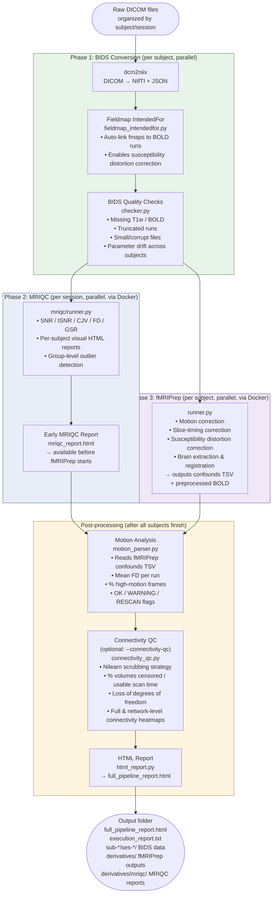

# fMRI Preprocessing Assistant

A cross-platform GUI and CLI tool for converting DICOM neuroimaging data to BIDS format, running MRIQC image quality assessment, running fMRIPrep preprocessing, and automatically assessing data quality at multiple levels.

---

## Pipeline Overview

The pipeline runs in three main phases, each containing one or more quality-control steps.



> **Early feedback:** When MRIQC finishes (Phase 2), a standalone `mriqc_report.html` is generated in the main output folder. The supervisor can review image quality immediately — without waiting for fMRIPrep to finish.

---

## Stage-by-Stage Explanation

### Phase 1: BIDS Conversion

#### BIDS Conversion
- **Tool:** `dcm2niix` (bundled in `tools/` or system-installed)
- **Input:** DICOM folders organized as `<subject>/<session>/`
- **Output:** NIfTI (`.nii.gz`) + sidecar JSON files in BIDS layout under `sub-<id>/ses-<id>/anat|func|fmap/`
- **Runs:** In parallel across all subjects
- **Field map linking:** When field maps are present (AP/PA EPI pairs or GRE phasediff), the pipeline automatically populates the `IntendedFor` field in each field map's JSON sidecar, matching field maps to BOLD runs by acquisition-time proximity. This enables fMRIPrep to apply susceptibility distortion correction without manual editing.

#### BIDS Quality Checks (`src/qc/checker.py`)
Runs **immediately after each subject's BIDS conversion**, before any further processing.

| Check | What it flags |
|---|---|
| Missing T1w | Session has no anatomical scan — fMRIPrep will fail |
| Missing BOLD | No functional data in session |
| Truncated BOLD run | Fewer timepoints than expected — scan may have been aborted |
| Small file | File size too small to be valid — possible corruption |
| Parameter drift | TR or field strength differs from the cohort median |

---

### Phase 2: MRIQC (`src/mriqc/runner.py`)
Runs **per session in parallel after BIDS conversion**, before fMRIPrep starts. Enabled by default; skip with `--skip-mriqc`.
Requires Docker. One-time image pull: `docker pull nipreps/mriqc:24.0.2`

MRIQC sessions are independent — each session's quality metrics are computed from that session's images alone. The pipeline automatically detects available Docker VM resources (CPU / RAM) and distributes them across parallel containers.

Metrics are evaluated using **within-study IQR-based outlier detection** (primary) and **absolute safety-net thresholds** (catch extreme values regardless of protocol). All thresholds below are defaults and can be adjusted per-run via the GUI or `--qc-thresholds` CLI argument.

| Metric | Meaning | Warning (IQR or fallback) | Error (safety net) |
|---|---|---|---|
| **SNR** (T1w) | Signal-to-noise in gray matter | < 6.0 | < 2.0 |
| **CNR** (T1w) | Contrast-to-noise ratio | < 2.0 | < 0.8 |
| **CJV** (T1w) | Coefficient of joint variation | > 0.60 | > 1.50 |
| **INU range** (T1w) | Intensity non-uniformity range | > 0.50 | > 1.00 |
| **QI1** (T1w) | Artifact presence in foreground | > 0.02 | > 0.10 |
| **tSNR** (BOLD) | Temporal signal stability | < 20.0 | < 5.0 |
| **FD mean** (BOLD) | Average head motion per TR | > 0.30 mm | > 1.00 mm |
| **GSR x/y** (BOLD) | EPI ghosting artifact | > 0.10 | > 0.30 |
| **AOR** (BOLD) | AFNI outlier ratio | > 0.10 | > 0.30 |

After MRIQC completes, a **standalone MRIQC report** (`mriqc_report.html`) is generated automatically in the main output folder. This provides early feedback on image quality before the longer fMRIPrep step begins.

> Always open the visual HTML reports — the images tell the full story.

---

### Phase 3: fMRIPrep (`src/fmriprep/runner.py`)
The core preprocessing step. Runs **per subject via Docker**, in parallel.

Performs:
- Motion correction & slice-timing correction
- Susceptibility distortion correction (automatic when field maps are present; optional SyN SDC fallback when they are not)
- Brain extraction & MNI registration
- Confound time series extraction (motion params, WM/CSF signals, CompCor)

**Output:** `derivatives/fmriprep/sub-<id>/` containing preprocessed BOLD NIfTI files and `*_confounds_timeseries.tsv`.

---

### Post-processing

#### Motion Analysis (`src/qc/motion_parser.py`)
Runs **after all fMRIPrep jobs complete**. Reads the confounds TSV files fMRIPrep produces. Thresholds are configurable.

| Flag | Condition (defaults) |
|---|---|
| OK | Mean FD < 0.5 mm and < 10% high-motion frames |
| WARNING | Mean FD >= 0.5 mm or >= 10% high-motion frames |
| RESCAN | Mean FD >= 1.0 mm or >= 20% high-motion frames |

#### Connectivity QC (`src/qc/connectivity_qc.py`) — *optional*
Runs **after motion analysis**, only with `--connectivity-qc` flag. Requires `nilearn` and `nibabel`.
Uses Nilearn's `load_confounds_strategy` with the `"scrubbing"` preset to handle confound selection and volume censoring.
Thresholds follow recommendations from [Parkes et al. / PMC10977879](https://pmc.ncbi.nlm.nih.gov/articles/PMC10977879/) and are configurable.

| Metric | What it means | Warning (default) | Fail (default) |
|---|---|---|---|
| Mean FD | Average framewise displacement | > 0.25 mm | > 0.50 mm |
| Censored volumes | Timepoints removed by scrubbing | > 50% | > 80% |
| Usable time | Clean data remaining after censoring | < 2 minutes | < 1 minute |
| Loss of DoF | Regressors + censored volumes as fraction of total | > 60% | — |

Additionally computes full (116x116) and network-level (~8x8) connectivity heatmaps on scrubbed data.

Result labels: **OK** / **WARNING** / **ERROR**

#### HTML Report (`src/reporting/html_report.py`)
Always the **last step**. Aggregates all QC findings into a single self-contained HTML file.

Sections in the report:
1. Overall status banner (green / yellow / red)
2. Per-subject summary table
3. BIDS quality findings
4. MRIQC Image Quality Metrics (unless `--skip-mriqc` was used)
5. Motion analysis
6. fMRIPrep Registration Quality — coregistration overlay SVGs (if fMRIPrep ran)
7. Connectivity QC (if enabled)
8. Pipeline failures (if any)
9. Researcher comments

---

## Output Structure

```
output_YYYYMMDD_HHMMSS/
├── dataset_description.json     ← BIDS dataset metadata (auto-generated)
├── .bidsignore                  ← Tells BIDS validators to skip non-BIDS files
├── sub-001/ses-01/              ← BIDS data (anat/, func/, etc.)
├── sub-002/ses-01/
├── ...
├── derivatives/
│   ├── fmriprep/
│   │   └── sub-001/            ← Preprocessed BOLD + confounds TSV files
│   ├── mriqc/
│   │   ├── group_T1w.html      ← Interactive group-level outlier scatter plots
│   │   ├── group_bold.html
│   │   └── sub-001/*.html      ← Per-scan visual quality reports
│   └── fmriprep_debug.log      ← Detailed error log for failed fMRIPrep runs
├── full_pipeline_report.html    ← Final QC report — open this in a browser
├── mriqc_report.html            ← Early MRIQC report (available before fMRIPrep)
├── execution_report.txt         ← Text summary of all pipeline steps
└── execution_logs/
    ├── raw_execution_log.log    ← Full pipeline console output with timestamps
    └── execution_logs_summary.txt ← Structured per-subject/session summary
```

---

## Quick Start

### 1. Run the GUI

```bash
python run.py
```

Dependencies are installed automatically on first run from `requirements.txt`. To install manually:

```bash
python -m venv venv
source venv/bin/activate        # Windows: venv\Scripts\activate
pip install -r requirements.txt
```

### 2. Select folders and run

1. **Select Source Folder** — your DICOM data (organized by subject/session)
2. **Select Output Folder** — where to save results
3. (Optional) Add **Researcher Comments** — free-text notes about the session (saved with the report)
4. (Optional) Expand **fMRIPrep Options** to configure preprocessing and anonymization
5. (Optional) Expand **Quality Check Thresholds** to adjust Warning/Error thresholds for any QC metric before launching a run (see below)
6. Click a button:
   - **BIDS Only** — DICOM to BIDS conversion only
   - **BIDS + MRIQC** — Conversion + image quality assessment (generates early MRIQC report)
   - **fMRIPrep Only** — Run fMRIPrep on existing BIDS data
   - **Connectivity QC Only** — Run connectivity analysis on existing fMRIPrep output
   - **Full Pipeline** — BIDS + MRIQC + fMRIPrep + all QC layers

> **Note:** Action buttons remain disabled until both Source and Output folders are selected (BIDS Only, BIDS + MRIQC, Full Pipeline), or until the Source folder contains the appropriate data (fMRIPrep Only requires BIDS NIfTI data; Connectivity QC requires fMRIPrep confounds output).

### 3. Configurable QC Thresholds

All QC thresholds (MRIQC, Motion, Connectivity) can be adjusted per-run without editing source code. In the GUI, expand the **Quality Check Thresholds** collapsible section to see four cards:

| Card | Metrics |
|---|---|
| **MRIQC - Anatomical** | Coeff. of Joint Variation, Contrast-to-Noise Ratio, Signal-to-Noise Ratio, Intensity Non-Uniformity Range, Artifact presence (QI1) |
| **MRIQC - BOLD** | Mean FD (mm), Temporal SNR, Ghost-to-Signal Ratio X/Y, AFNI Outlier Ratio |
| **Motion Analysis** | Mean FD (mm), High-Motion Frames (%) |
| **Connectivity Quality Check** | Mean FD (mm), Censored Volumes (%), Usable Time (min), Loss of Degrees of Freedom |

Each metric has editable **Warning** and **Error** value fields pre-filled with the defaults. Changes are validated live (non-numeric values are highlighted red). Click **Save** to confirm your overrides, or **Reset to Defaults** to revert.

When a run starts, any modified thresholds are passed to the pipeline via the `--qc-thresholds` CLI argument (base64-encoded JSON). The defaults remain unchanged when no overrides are set.

---

## Command Line Usage

```bash
# Full pipeline (BIDS + MRIQC + fMRIPrep + QC) — MRIQC runs by default
python -m src.orchestrator --input /path/to/dicom --output_dir /path/to/output

# BIDS + MRIQC only (skip fMRIPrep)
python -m src.orchestrator --input /path/to/dicom --output_dir /path/to/output --skip-fmriprep

# BIDS conversion only (skip fMRIPrep and MRIQC)
python -m src.orchestrator --input /path/to/dicom --output_dir /path/to/output --skip-fmriprep --skip-mriqc

# Full pipeline + connectivity QC (requires nilearn)
python -m src.orchestrator --input /path/to/dicom --output_dir /path/to/output --connectivity-qc

# Process a single subject (with optional session filter)
python -m src.orchestrator --input /path/to/dicom --output_dir /path/to/output --subject 010 --session 01

# Run fMRIPrep on an existing BIDS folder
python -m src.orchestrator --bids-folder /path/to/output_YYYYMMDD_HHMMSS

# Re-run QC only on an existing output folder (no reprocessing)
python -m src.orchestrator --qc-only --bids-folder /path/to/output_YYYYMMDD_HHMMSS

# With DICOM metadata anonymization
python -m src.orchestrator --input /path/to/dicom --output_dir /path/to/output --anonymize

# Control parallelism (default: auto-detected, 4–12 workers)
python -m src.orchestrator --input /path/to/dicom --output_dir /path/to/output --parallel 6

# Keep intermediate work directories for debugging
python -m src.orchestrator --input /path/to/dicom --output_dir /path/to/output --keep-temp

# Long FreeSurfer recon-all run (adds ~6+ hours per subject)
python -m src.orchestrator --input /path/to/dicom --output_dir /path/to/output \
  --fmriprep-opts "$(python - << 'PY'
import base64, json
print(base64.b64encode(json.dumps({'fs_reconall': True}).encode()).decode())
PY
)"

# Override QC thresholds (e.g. stricter motion warning)
python -m src.orchestrator --input /path/to/dicom --output_dir /path/to/output \
  --qc-thresholds "$(python - << 'PY'
import base64, json
overrides = {
    "motion": {"warn_mean_fd": 0.3, "rescan_mean_fd": 0.7},
    "iqm_bold": {"tsnr": [25.0, 8.0, "low"]}
}
print(base64.b64encode(json.dumps(overrides).encode()).decode())
PY
)"
```

The `--qc-thresholds` argument accepts a base64-encoded JSON object. Only keys that differ from defaults need to be included. The JSON schema:

```json
{
  "iqm_anat": { "<metric>": [warn, error, "high"|"low"] },
  "iqm_bold": { "<metric>": [warn, error, "high"|"low"] },
  "motion": { "warn_mean_fd": 0.3, "rescan_mean_fd": 0.7, ... },
  "connectivity": { "connectivity_mean_fd_warn": 0.20, ... }
}
```

---

## Requirements

| Requirement | Purpose |
|---|---|
| Python 3.9+ | Core application |
| `dcm2niix` | BIDS conversion (bundled in `tools/` or system-installed) |
| Docker Desktop | fMRIPrep and MRIQC (both run in containers) |
| [FreeSurfer License](https://surfer.nmr.mgh.harvard.edu/registration.html) | Required by fMRIPrep (free registration) |

All Python dependencies (including `nilearn`, `nibabel`, `matplotlib` for connectivity QC) are listed in `requirements.txt` and installed automatically on first run.

### Docker Desktop Performance

On macOS and Windows, Docker runs inside a VM with its own resource limits. The pipeline automatically detects Docker's available CPUs and RAM and will warn if they are low. For best performance:

1. Open **Docker Desktop > Settings > Resources**
2. Set **CPUs** to at least half your machine's cores (e.g. 8 of 14)
3. Set **Memory** to at least half your RAM (e.g. 48 GB of 96 GB)
4. Click **Apply & Restart**

---

## Project Structure

```
fMRI_Masters/
├── run.py                      # Entry point — auto-installs deps, launches GUI or CLI
├── src/
│   ├── orchestrator.py         # Pipeline coordinator — start here to understand the code
│   ├── gui/                    # GUI application (CustomTkinter)
│   ├── core/                   # Subject discovery, progress tracking, utilities
│   ├── bids/                   # BIDS conversion using dcm2niix
│   │   ├── converter.py        # DICOM → NIfTI conversion (parallel per subject)
│   │   ├── fieldmap_intendedfor.py  # Auto-populate IntendedFor in fmap sidecars
│   │   └── analyzer.py         # Count output files by modality
│   ├── mriqc/                  # MRIQC image quality assessment (dedicated module)
│   │   ├── runner.py           # MRIQC Docker runner (parallel per session)
│   │   └── iqm_parser.py       # Parses MRIQC IQM JSON metrics & flags outliers
│   ├── fmriprep/               # fMRIPrep preprocessing
│   │   └── runner.py           # fMRIPrep Docker runner (parallel per subject)
│   ├── qc/                     # Quality control layers
│   │   ├── checker.py          # BIDS quality checks (missing scans, corruption)
│   │   ├── motion_parser.py    # Motion analysis from fMRIPrep confounds
│   │   ├── connectivity_qc.py  # Nilearn-based connectivity QC (scrubbing, heatmaps)
│   │   ├── connectivity_thresholds.py  # Thresholds from literature
│   │   └── atlas_data/         # Bundled Schaefer+Tian brain parcellation atlas
│   └── reporting/
│       ├── html_report.py      # HTML QC report generator (full + standalone MRIQC)
│       └── report.py           # Text execution report
├── docs/
│   ├── BIDS_CONVERSION_GUIDE.md
│   ├── FMRIPREP_GUIDE.md
│   ├── FREESURFER_LICENSE.md
│   ├── MRIQC_REPORT_GUIDE.md
│   └── researcher_guide.html   # Visual step-by-step researcher guide
├── test/                       # Test suite (80 tests)
└── tools/                      # Bundled dcm2niix binary
```

---

## Documentation

| Guide | Description |
|---|---|
| [Researcher Guide](docs/researcher_guide.html) | Visual step-by-step guide: setup, running, interpreting results |
| [BIDS Conversion Guide](docs/BIDS_CONVERSION_GUIDE.md) | Input folder format, conversion steps, output layout |
| [fMRIPrep Guide](docs/FMRIPREP_GUIDE.md) | Preprocessing steps, output files, confounds |
| [FreeSurfer License](docs/FREESURFER_LICENSE.md) | How to obtain and configure the FreeSurfer license |
| [MRIQC Report Guide](docs/MRIQC_REPORT_GUIDE.md) | Understanding MRIQC output and image quality metrics |

---

## License

MIT License

## References

- [BIDS Specification](https://bids-specification.readthedocs.io/)
- [dcm2niix](https://github.com/rordenlab/dcm2niix)
- [fMRIPrep](https://fmriprep.org/)
- [MRIQC](https://mriqc.readthedocs.io/)
- Parkes et al. (2018) — Quality control practices for functional connectivity studies
