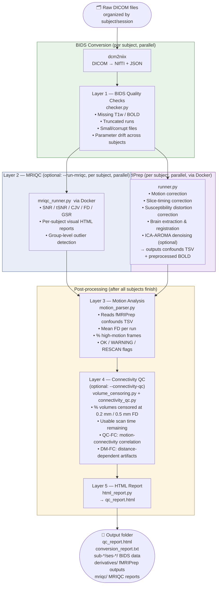

# fMRI Preprocessing Assistant

A cross-platform GUI and CLI tool for converting DICOM neuroimaging data to BIDS format, running fMRIPrep preprocessing, and automatically assessing data quality at multiple levels.

---

## Pipeline Overview

The pipeline is made up of distinct stages that run in sequence. Understanding these stages is the key to using this tool effectively.



> **Note on layer numbering:** The numbers (1–5) reflect the execution order. Layer 5 (the HTML report) is always the final step.

---

## Stage-by-Stage Explanation

### BIDS Conversion
- **Tool:** `dcm2niix` (bundled in `tools/` or system-installed)
- **Input:** DICOM folders organized as `<subject>/<session>/`
- **Output:** NIfTI (`.nii.gz`) + sidecar JSON files in BIDS layout under `sub-<id>/ses-<id>/anat|func/`
- **Runs:** In parallel across all subjects

---

### Layer 1 — BIDS Quality Checks (`src/qc/checker.py`)
Runs **immediately after each subject's BIDS conversion**, before fMRIPrep starts.

| Check | What it flags |
|---|---|
| Missing T1w | Session has no anatomical scan → fMRIPrep will fail |
| Missing BOLD | No functional data in session |
| Truncated BOLD run | Fewer timepoints than expected → scan may have been aborted |
| Small file | File size too small to be valid → possible corruption |
| Parameter drift | TR or field strength differs from the cohort median |

---

### Layer 2 — MRIQC (`src/fmriprep/mriqc_runner.py`) — *optional*
Runs **per subject after BIDS conversion**, in parallel with fMRIPrep.  
Requires Docker and `--run-mriqc` flag. One-time image pull: `docker pull nipreps/mriqc:latest`

| Metric | Meaning | Red flag |
|---|---|---|
| **SNR / CNR** (T1w) | Structural signal quality | Very low → poor image quality |
| **CJV** (T1w) | Coefficient of joint variation | > 0.7 → motion or B1 artifact |
| **tSNR** (BOLD) | Temporal signal stability | < 30 → noisy data |
| **FD mean** (BOLD) | Average head motion per TR | > 0.5 mm → elevated motion |
| **GSR x/y** (BOLD) | EPI ghosting artifact | > 0.1 → check phase-encode direction |

> Always open the visual HTML reports — the images tell the full story.

---

### fMRIPrep (`src/fmriprep/runner.py`)
The core preprocessing step. Runs **per subject via Docker**, in parallel.

Performs:
- Motion correction & slice-timing correction
- Susceptibility distortion correction (fieldmap-based)
- Brain extraction & MNI registration
- Confound time series extraction (motion params, WM/CSF signals, CompCor)

**Output:** `derivatives/fmriprep/sub-<id>/` containing preprocessed BOLD NIfTI files and `*_confounds_timeseries.tsv` — these are the inputs to Layer 3 and Layer 5.

---

### Layer 3 — Motion Analysis (`src/qc/motion_parser.py`)
Runs **after all fMRIPrep jobs complete**. Reads the confounds TSV files fMRIPrep produces.

| Flag | Condition |
|---|---|
| ✅ OK | Mean FD ≤ 0.5 mm and ≤ 20% high-motion frames |
| ⚠️ WARNING | Mean FD 0.5–0.8 mm or 20–50% high-motion frames |
| 🔴 RESCAN | Mean FD > 0.8 mm or > 50% high-motion frames |

---

### Layer 4 — Connectivity QC (`src/qc/volume_censoring.py` + `src/qc/connectivity_qc.py`) — *optional*
Runs **after Layer 3**, only with `--connectivity-qc` flag. Requires `nilearn` and `nibabel`.  
Based on [Parkes et al. / PMC10977879](https://pmc.ncbi.nlm.nih.gov/articles/PMC10977879/).

| Sub-layer | Metric | What it means | Pass threshold |
|---|---|---|---|
| **4a** | % volumes censored | Timepoints removed at 0.2 mm FD | < 80% |
| **4a** | Usable scan time | Clean data remaining after scrubbing | ≥ 1 minute |
| **4b** | QC-FC | Correlation between motion and connectivity | < 0.1 (warn > 0.2) |
| **4b** | DM-FC | Distance-dependent motion artifact | ≈ 0 (fail > 0.1) |

Result labels: 🟢 **Ready** / 🟡 **Marginal** / 🔴 **Not Suitable**

---

### Layer 5 — HTML Report (`src/reporting/html_report.py`)
Always the **last step**. Aggregates all QC findings into a single self-contained HTML file.

Sections in the report:
1. Overall status banner (green / yellow / red)
2. Per-subject summary table
3. BIDS quality findings (Layer 1)
4. MRIQC Image Quality Metrics (Layer 2, if used)
5. Motion analysis (Layer 3)
6. Connectivity QC (Layer 4, if used)

---

## Output Structure

```
output_YYYYMMDD_HHMMSS/
├── sub-001/ses-01/         ← BIDS data (anat/, func/, etc.)
├── sub-002/ses-01/
├── ...
├── derivatives/
│   └── fmriprep/
│       └── sub-001/        ← Preprocessed BOLD + confounds TSV files
├── mriqc/                  ← Only if --run-mriqc
│   ├── group_T1w.html
│   ├── group_bold.html
│   └── sub-001/anat/*.html
├── qc_report.html          ← Main QC report — open this in a browser
├── conversion_report.txt   ← Text summary of all pipeline steps
└── fmriprep_debug.log      ← Detailed error log for failed fMRIPrep runs
```

---

## Quick Start

### 1. Install Dependencies

```bash
python -m venv venv
source venv/bin/activate        # Windows: venv\Scripts\activate
pip install -r requirements.txt
```

### 2. Run the GUI

```bash
python run.py
```

1. **Select Source Folder** — your DICOM data (organized by subject/session)
2. **Select Output Folder** — where to save results
3. (Optional) Expand **fMRIPrep Options** to configure preprocessing
4. Click a button:
   - 🟢 **Run BIDS Conversion** — DICOM → BIDS only (no fMRIPrep)
   - 🔵 **Run Full Pipeline** — BIDS + fMRIPrep + all QC layers

---

## Command Line Usage

```bash
# Full pipeline (BIDS + fMRIPrep + QC)
python -m src.orchestrator --input /path/to/dicom --output_dir /path/to/output

# BIDS conversion only (skip fMRIPrep)
python -m src.orchestrator --input /path/to/dicom --output_dir /path/to/output --skip-fmriprep

# Full pipeline + MRIQC image quality assessment
python -m src.orchestrator --input /path/to/dicom --output_dir /path/to/output --run-mriqc

# Full pipeline + connectivity QC (requires nilearn)
python -m src.orchestrator --input /path/to/dicom --output_dir /path/to/output --connectivity-qc

# Re-run QC only on an existing output folder (no reprocessing)
python -m src.orchestrator --qc-only --bids-folder /path/to/output_YYYYMMDD_HHMMSS

# Re-run QC + MRIQC on an existing output folder
python -m src.orchestrator --qc-only --bids-folder /path/to/output_YYYYMMDD_HHMMSS --run-mriqc

# With DICOM metadata anonymization
python -m src.orchestrator --input /path/to/dicom --output_dir /path/to/output --anonymize

# Long FreeSurfer recon-all run (adds ~6+ hours per subject)
python -m src.orchestrator --input /path/to/dicom --output_dir /path/to/output \
  --fmriprep-opts "$(python - << 'PY'
import base64, json
print(base64.b64encode(json.dumps({'fs_reconall': True}).encode()).decode())
PY
)"
```

---

## Requirements

| Requirement | Purpose |
|---|---|
| Python 3.10+ | Core application |
| `dcm2niix` | BIDS conversion (bundled in `tools/` or system-installed) |
| Docker Desktop | fMRIPrep and MRIQC (both run in containers) |
| [FreeSurfer License](https://surfer.nmr.mgh.harvard.edu/registration.html) | Required by fMRIPrep (free registration) |
| `nilearn`, `nibabel` | Layer 5 Connectivity QC only (`pip install -r requirements.txt`) |

---

## Project Structure

```
fMRI_Masters/
├── run.py                      # Entry point for the GUI
├── src/
│   ├── orchestrator.py         # Pipeline coordinator — start here to understand the code
│   ├── gui/                    # GUI application (Tkinter)
│   ├── core/                   # Subject discovery, progress tracking, utilities
│   ├── bids/                   # BIDS conversion using dcm2niix
│   ├── fmriprep/
│   │   ├── runner.py           # fMRIPrep Docker runner
│   │   └── mriqc_runner.py     # MRIQC Docker runner (Layer 2)
│   ├── qc/
│   │   ├── checker.py          # Layer 1: BIDS quality checks
│   │   ├── iqm_parser.py       # Layer 2: Parses MRIQC IQM JSON output
│   │   ├── motion_parser.py    # Layer 3: Motion analysis from fMRIPrep confounds
│   │   ├── volume_censoring.py # Layer 4a: Volume censoring analysis
│   │   ├── connectivity_qc.py  # Layer 4b: QC-FC and DM-FC metrics
│   │   └── connectivity_thresholds.py  # Thresholds from literature
│   └── reporting/
│       ├── html_report.py      # Layer 5: HTML QC report generator
│       └── report.py           # Text conversion report
├── docs/
│   ├── BIDS_CONVERSION_GUIDE.md
│   └── FMRIPREP_GUIDE.md
├── test/                       # Test suite
└── tools/                      # Bundled dcm2niix binary
```

---

## Documentation

| Guide | Description |
|---|---|
| [BIDS Conversion Guide](docs/BIDS_CONVERSION_GUIDE.md) | Input folder format, conversion steps, output layout |
| [fMRIPrep Guide](docs/FMRIPREP_GUIDE.md) | Preprocessing steps, output files, confounds |

---

## License

MIT License

## References

- [BIDS Specification](https://bids-specification.readthedocs.io/)
- [dcm2niix](https://github.com/rordenlab/dcm2niix)
- [fMRIPrep](https://fmriprep.org/)
- [MRIQC](https://mriqc.readthedocs.io/)
- Parkes et al. (2018) — QC-FC and DM-FC metrics for connectivity studies
