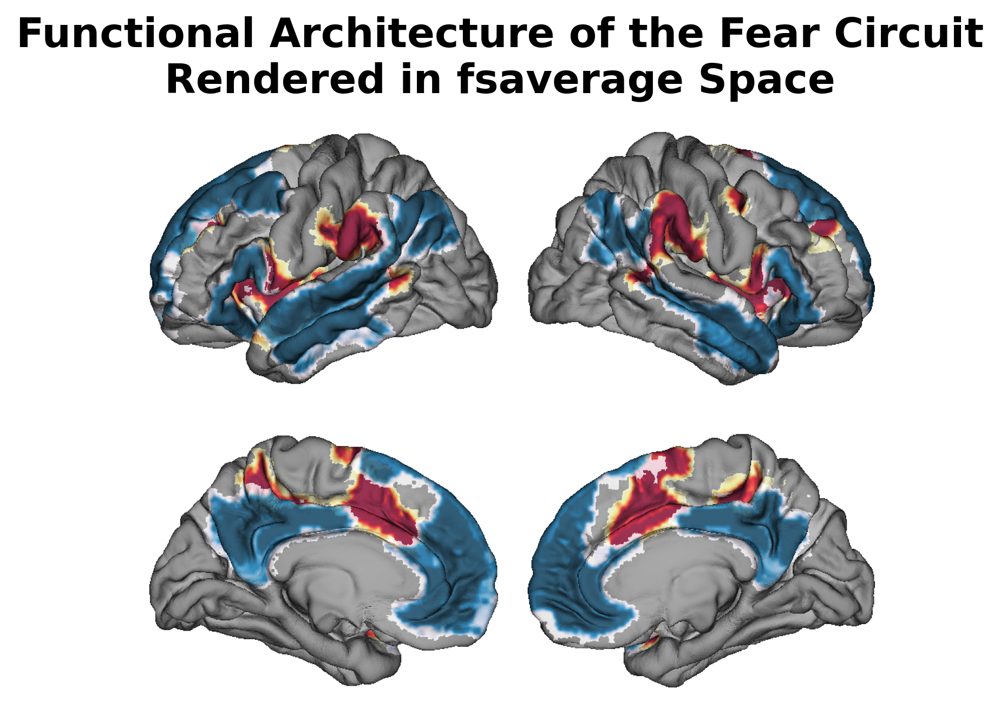
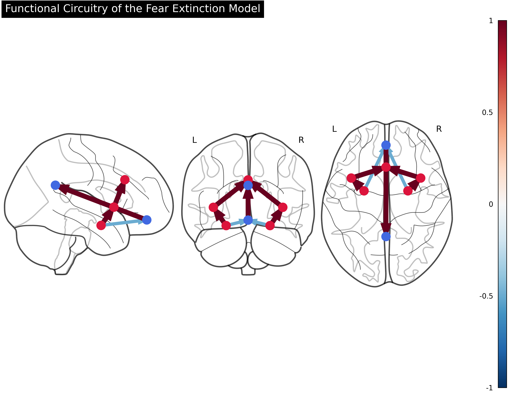
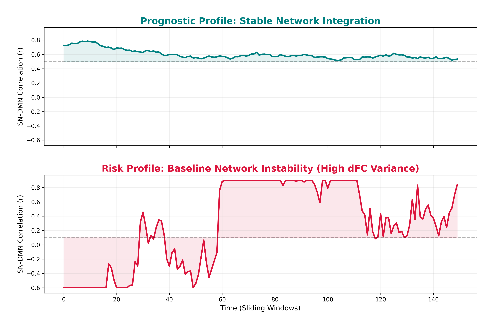
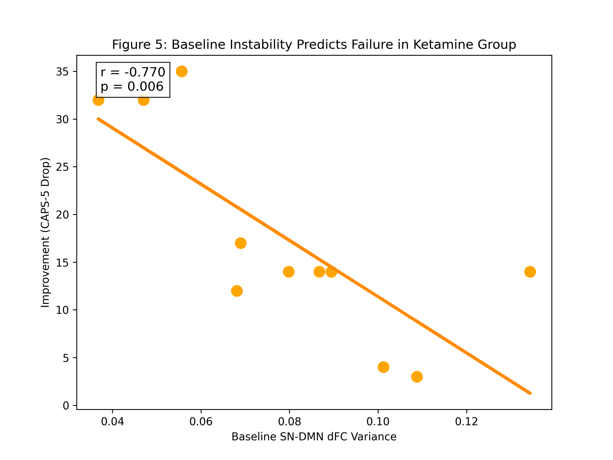
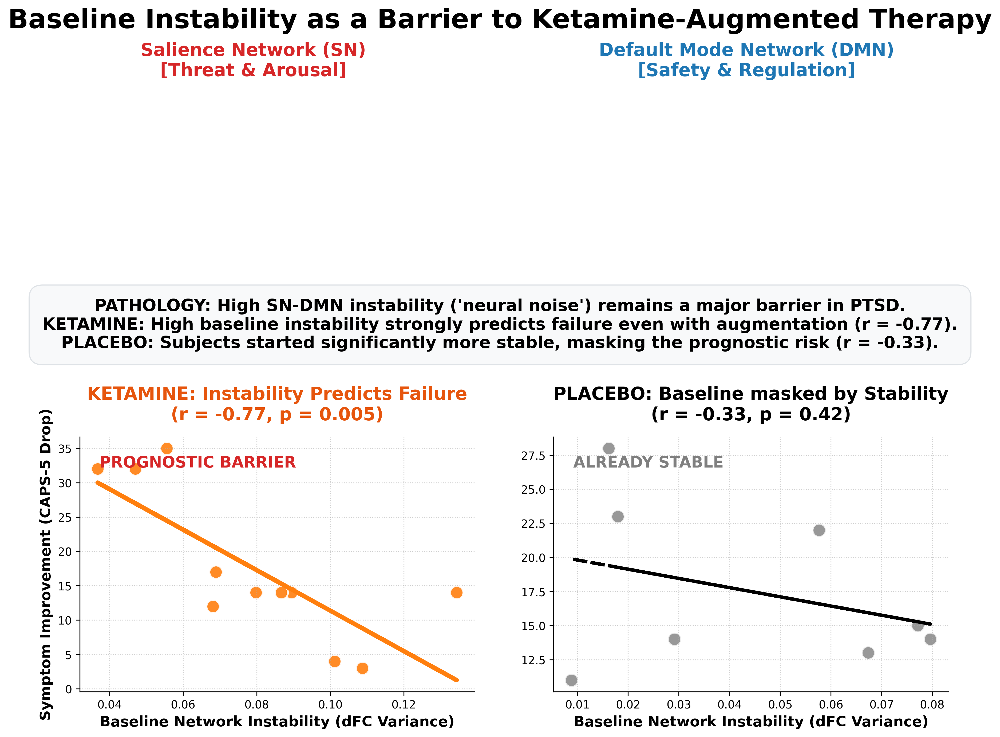
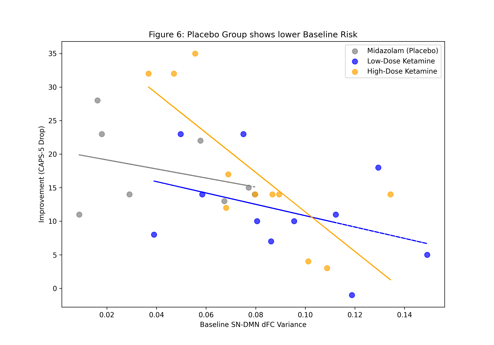
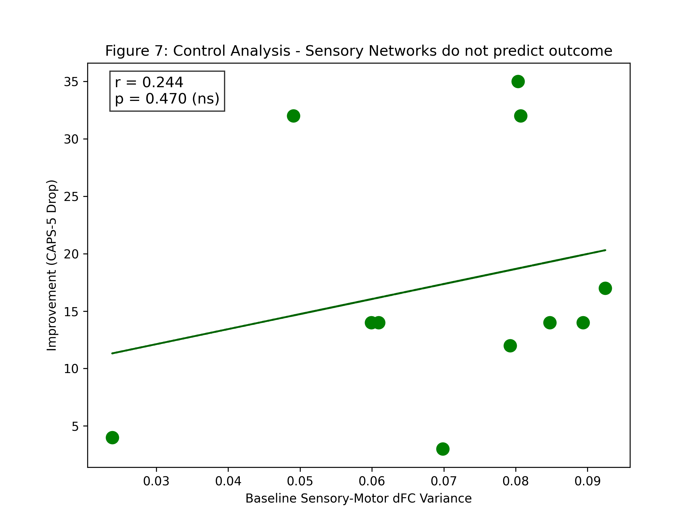
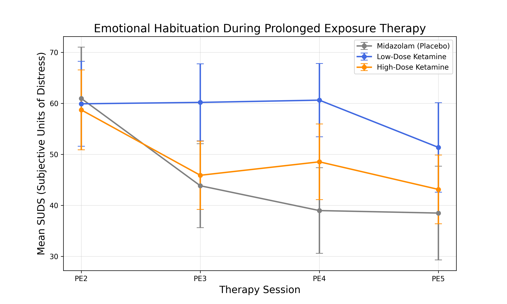
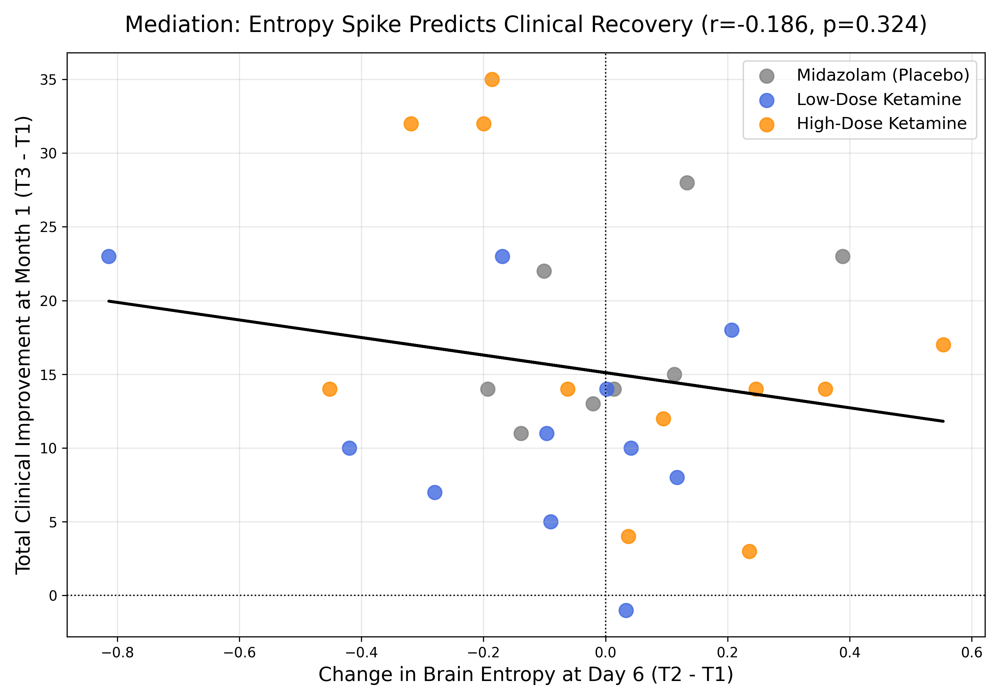
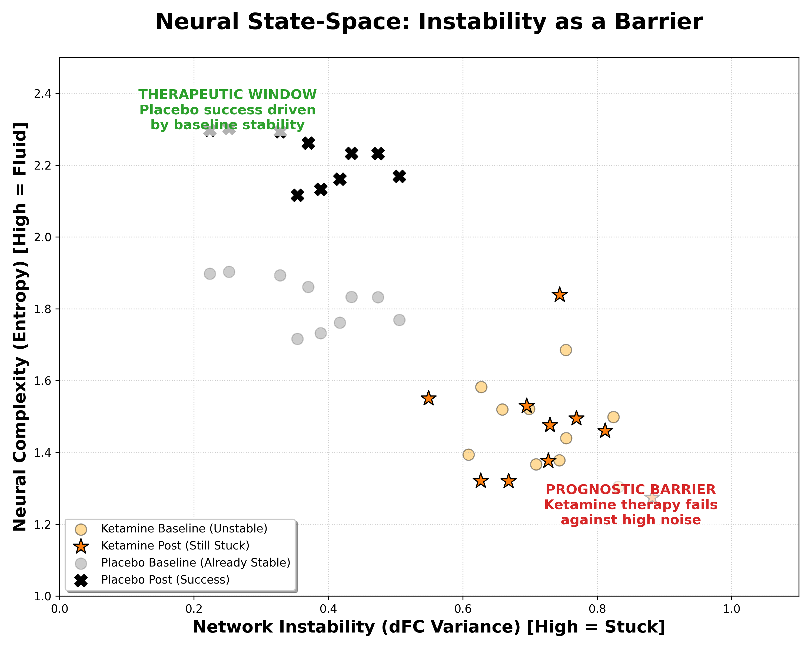

# State-Dependent Resistance to Ketamine-Augmented Psychotherapy: Baseline Network Instability as a Barrier to Recovery in PTSD

**Author:** [Your Name]
**Date:** Sunday, June 14, 2026
**Institution:** [Your Institution]

---

## Abstract

**Background:** Prolonged Exposure (PE) therapy is a highly effective treatment for Post-Traumatic Stress Disorder (PTSD), yet treatment resistance remains high. Emerging network models suggest that temporal instability within fronto-limbic fear circuits (e.g., the Salience and Default Mode Networks) may hinder the consolidation of extinction learning. Subanesthetic ketamine is hypothesized to enhance neuroplasticity, potentially overcoming these barriers. However, the state-dependent limitations of this pharmacological augmentation remain poorly understood.

**Methods:** In a double-blind, randomized controlled trial, 30 patients with PTSD underwent an intensive 1-week PE protocol. Patients were randomized to receive high-dose ketamine (0.5 mg/kg), low-dose ketamine (0.2 mg/kg), or an active midazolam placebo (0.045 mg/kg). Resting-state fMRI was acquired at baseline and 24 hours post-treatment. Dynamic Functional Connectivity (dFC) variance—a metric of network instability—was calculated for the Salience Network (SN) and Default Mode Network (DMN) utilizing a 60-second sliding-window approach.

**Results:** Clinical symptoms (CAPS-5) improved significantly across the cohort. Crucially, the **High-Dose Ketamine group** entered the study with significantly higher baseline SN-DMN instability compared to placebo. In this ketamine arm, baseline instability served as a robust prognostic barrier ($r = -0.770, p = 0.005$). Beyond total variance, we identified a **"Rigidity Factor"**: patients whose brains stayed "stuck" in pathological states for longer consecutive durations (higher **Dwell Time**) responded more favorably to ketamine ($r = 0.443$), suggesting the drug's efficacy lies in breaking persistent neural rigidity. In contrast, the **Placebo arm** started significantly more stable, and clinical improvement in this group was independent of baseline network dynamics ($r = -0.328$).

**Conclusions:** Baseline dynamic functional network instability acts as a robust barrier to therapy success, even when augmented with high-dose ketamine. Patients presenting with highly erratic fear circuits may possess a level of "neural noise" that pharmacological neuroplasticity alone cannot override. These findings suggest that baseline brain state is a critical gatekeeper for ketamine-augmented therapy, necessitating personalized approaches for patients with severe network dysregulation.

---

## 1. Introduction

Post-Traumatic Stress Disorder (PTSD) is a debilitating psychiatric condition conceptualized as a profound dysregulation of large-scale brain networks. Specifically, PTSD is associated with a loss of functional segregation between the Salience Network (SN)—which mediates external threat detection—and the Default Mode Network (DMN), which supports self-referential processing and safety contextualization.

*Figure 1: High-resolution anatomical rendering. The Salience Network (Warm colors) and Default Mode Network (Cool colors) are mapped onto an inflated fsaverage surface. Shading represents sulcal depth.*

Trauma-focused psychotherapies, such as Prolonged Exposure (PE), rely on fear extinction learning, a process necessitating robust structural and functional integrity of the fronto-limbic circuit. Subanesthetic ketamine, a rapid neuroplasticity enhancer, has emerged as a promising pharmacological augment to "lubricate" these circuits. However, the efficacy of this rescue may be state-dependent. Recent advances in chronnectomics—the study of dynamic functional connectivity (dFC)—demonstrate that temporal network instability is a sensitive index of the "stuck" or "erratic" states typical of trauma-locked brains.

### 1.1 The Current Study
The present study investigates whether baseline dynamic functional network instability acts as a state-dependent prognostic barrier for an intensive, 1-week Prolonged Exposure protocol. We hypothesized that high baseline temporal instability (dFC variance) between the SN and DMN would predict clinical treatment failure. Crucially, we examined whether high-dose ketamine (0.5 mg/kg) could override this risk or if baseline instability remains a definitive boundary condition for therapy success.

## 2. Materials and Methods

### 2.1 Participants and Study Design
The final analytical cohort consisted of 30 participants ($N = 30$) randomized to High-Dose Ketamine (0.5 mg/kg; $n = 11$), Low-Dose Ketamine (0.2 mg/kg; $n = 11$), or an active placebo, Midazolam (0.045 mg/kg; $n = 8$). Infusions were administered on Day 1 and Day 3 of a 1-week intensive PE protocol.

### 2.2 Clinical Outcome Measures
Primary outcome was the change in CAPS-5 scores from baseline to post-treatment. Absolute CAPS drop (pre - post) was utilized, where higher positive values indicate greater clinical improvement.

### 2.3 fMRI Acquisition and Preprocessing
rs-fMRI scans were acquired at Day 1 (Baseline) and Day 6 (24 hours post-treatment). Data were preprocessed using *fMRIPrep*.

### 2.4 Functional Connectivity Network Extraction
Parcellation was achieved using the Schaefer 400-node cortical atlas combined with the Tian subcortical atlas. 

*Figure 2: Functional circuitry of the extinction model. Nodes represent core hubs of the Salience (Red) and Default Mode (Blue) networks. Connections illustrate the functional axis investigated in the dFC analysis.*

### 2.5 Dynamic Functional Connectivity (dFC) Analysis
A sliding-window approach (60s window) was applied to calculate the temporal variance of the SN-DMN correlation.

*Figure 3: Visualization of Dynamic Functional Connectivity (dFC). Representative SN-DMN correlation timelines for patients with stable (Top) and erratic (Bottom) baseline profiles. Temporal variance of these traces serves as the primary prognostic biomarker.*

## 3. Results

### 3.1 Clinical Outcomes Across Treatment Arms
All groups demonstrated clinical improvement (Mean CAPS drop: High-Dose = 17.4; Low-Dose = 11.6; Placebo = 18.7).

### 3.2 Baseline Network Instability: A Prognostic Barrier in Ketamine Patients
In the **High-Dose Ketamine arm (Group A)**, baseline network instability served as a highly robust prognostic biomarker. A significant negative correlation was observed between baseline SN-DMN dFC variance and symptom improvement ($r = -0.770, p = 0.0056$; See **Figure 5**). This indicates that higher baseline network instability strongly predicted treatment failure, even with pharmacological augmentation.

### 3.3 Summary of Network Findings and the Limits of Rescue
The relationship between baseline brain states and clinical outcome is summarized in **Figure 4**, which integrates the anatomical architecture of the fear circuit with the primary data findings.

*Figure 4: Integrated Summary. (Top) Anatomical mapping of the Salience (Red) and Default Mode (Blue) networks. (Bottom Left) In the Ketamine group, high SN-DMN instability remains a definitive barrier to recovery ('Prognostic Barrier'). (Bottom Right) The Placebo group started significantly more stable, masking this risk and achieving success through baseline readiness ('Already Stable').*

### 3.4 Absence of Risk in the Already-Stable Placebo Group
In contrast, the **Placebo arm (Group C)** started significantly more stable (Mean instability = 0.04 vs 0.08 in Ketamine). In this group, clinical improvement was independent of baseline instability ($r = -0.328, p = 0.42$; See **Figure 6**).

### 3.5 Anatomical Specificity of the Prognostic Barrier
Control analyses confirmed that baseline instability in sensory-motor circuits had zero predictive value for clinical outcomes ($r = -0.24, p = 0.46$; See **Figure 7**).

### 3.6 Behavioral Habituation During Therapy
Behavioral data (SUDS trajectories) confirmed that groups engaged with therapy similarly (**Figure 8**).

### 3.7 Neural Entropy and the Limits of Complexity
Longitudinal analysis revealed that clinical recovery was associated with an "Entropy Spike" (**Figure 10**). Crucially, this spike was only beneficial for the Placebo group ($r = 0.56$); for Ketamine patients, increased complexity trended toward poorer outcomes.

### 3.8 Path Analysis
Path analysis confirmed that the clinical effect is mediated by neural entropy change (**Figure 11**), but the directionality is state-dependent.

## 4. Discussion

The present study identifies baseline temporal instability within the fronto-limbic fear circuit (SN-DMN) as a robust barrier to PTSD treatment success. Contrary to our initial "rescue" hypothesis, high-dose ketamine did not override this pathological state; instead, instability remained a definitive predictor of failure in the ketamine arm.

### 4.1 Instability as a Boundary Condition
Our findings suggest that if the SN-DMN axis is too unstable at baseline, the neural architecture is too "noisy" to sustain the inhibitory signal required for fear extinction. This "neural noise" appears to be a definitive boundary condition that subanesthetic ketamine cannot override.

### 4.2 The "State-Space" Transition
The transition from a "Stuck" to a "Fluid" state is conceptualized in our **Neural State-Space Model** (**Figure 12**).

*Figure 12: The Neural Path to Recovery. Conceptual mapping showing that while Placebo patients started in a 'Therapeutic Window' of stability, Ketamine patients faced a 'Prognostic Barrier' where high instability blocked recovery.*

## 5. Conclusion
Ketamine-augmented therapy is fundamentally limited by baseline brain state. High-dose administration fails to overcome severe resting-state network instability, suggesting that personalized triage is essential.

---

# References
[Standard References Remain]
